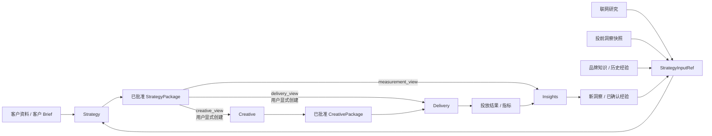

# Strategy 契约与四系统闭环方案

> 归属：Strategy × Creative 跨系统工作流；不属于 Kanon `docs/` 文档集。
>
> 状态：MVP 决策稿
>
> 日期：2026-07-28
>
> 范围：Strategy、Creative、Delivery、Insights 四个系统
>
> 目标：先建立可落地、可演进的领域契约和最短业务闭环，不追求一次性覆盖所有渠道与研究能力。
>
> Creative 前后端实现以 [Strategy → Creative 前后端开发契约](./25-strategy-to-creative-development-contract.md) 为准。
> Strategy 线近期实施顺序见 [Strategy 线短期工作计划 TODO](./26-strategy-short-term-todo.md)。

## 1. 结论先行

### 1.1 Strategy 同时影响 Creative 和 Delivery

Strategy 不是只服务 Creative 的“内容策略”。一份策略至少包含两类决定：

- 面向 Creative：对谁说、说什么、信息优先级、内容假设、必须出现和禁止出现的内容。
- 面向 Delivery：在哪投、投给谁、预算和节奏如何分配、验证什么假设、以什么指标判断。

因此，Creative 和 Delivery 都应直接消费同一个已批准的 `StrategyPackage`，但读取各自的投影视图：

- `creative_view`
- `delivery_view`
- `measurement_view`，供 Insights 建立测量上下文

Creative 不应替 Delivery 转述策略，Delivery 也不应从 Creative 成品反推策略。这样可以避免预算、受众、指标和内容信息在系统之间逐层失真。

### 1.2 Brief、Strategy 和执行 Brief 不是同一个对象

三者应明确分工：

| 对象 | 回答的问题 | 所有者 | 特征 |
|---|---|---|---|
| `BriefVersion` | 客户给了什么、我们确认了什么 | Strategy | 事实和需求，不替客户做策略决定 |
| `StrategyRevision` | 基于现有证据，我们决定做什么以及为什么 | Strategy | 决策、假设、取舍 |
| `ExecutionBrief` | 某个具体内容任务如何执行 | Creative | 创作者、规格、镜头、交付物、排期 |

娇兰样例更接近 KOL 执行 Brief：它包含产品事实、固定话术、禁区、功效依据、使用方式、画面要求和交付节点。这些内容对 Creative 很重要，但不应全部塞进 Strategy 的核心对象。正确做法是：

1. StrategyPackage 提供稳定的策略方向、内容边界和证据引用。
2. Creative 基于 `creative_view` 生成按渠道、内容形态或创作者拆分的 `ExecutionBrief`。
3. 产品功效、法规依据、标准免责声明等大块资料保存在品牌知识或声明库中，通过不可变引用进入策略包。

### 1.3 输入采用“证据引用”，而不是不断扩张 Brief

Strategy 的输入可能来自：

- 客户原始资料
- 客户梳理后的 Brief
- 联网搜索和行业研究
- 投前洞察、平台数据和爬取快照
- 品牌知识库
- 历史项目经验

这些来源不应全部变成 Brief 字段，也不应把原始爬取数据复制进 Strategy。统一使用 `StrategyInputRef` 表达“本次决策使用了哪个来源的哪个版本”，由相应系统保留原始内容。

### 1.4 MVP 不自动创建下游任务

`strategy.approved.v1` 表示策略包可以被下游使用，不等于自动开始生产或投放。用户仍需显式执行：

- “基于此策略创建 Creative Intake”
- “基于此策略创建 Delivery Plan 草稿”

这能保留人的工作流控制，也避免一次策略调整自动制造大量下游任务。

---

## 2. 四系统职责边界



### 2.1 Strategy

Strategy 负责：

- 确认并版本化客户 Brief。
- 组织研究和证据引用。
- 形成策略决策与假设。
- 批准并发布不可变 StrategyPackage。
- 当输入、判断或批准状态发生变化时创建新版本。

Strategy 不负责：

- 保存搜索引擎或爬虫的全部原始数据。
- 编写每个创作者的镜头脚本和交付日程。
- 创建投放账户、执行预算变更或回写平台。

### 2.2 Creative

Creative 负责：

- 基于指定 StrategyPackage 创建 Creative Intake。
- 将策略方向细化为渠道和任务级 ExecutionBrief。
- 生产、评审和批准 CreativePackage。
- 保留创意资产与对应策略、证据和假设的关联。

Creative 不拥有 Strategy 的事实来源或投放预算决策。

### 2.3 Delivery

Delivery 负责：

- 基于指定 StrategyPackage 创建 DeliveryPlan。
- 读取 `delivery_view` 中的目标、受众、渠道、预算、节奏、实验和测量约束。
- 绑定已批准 CreativePackage 后执行或模拟执行。
- 采集并发布规范化投放结果。

Delivery 不应只依赖 CreativePackage。创意包回答“投什么”，StrategyPackage 还回答“为什么投、投给谁、如何分配和验证”。

### 2.4 Insights

Insights 负责：

- 生成不可变的投前洞察快照。
- 接收 Creative 和 Delivery 结果并进行特征、指标和归因分析。
- 将观察提升为可复用、可确认的洞察或经验。
- 保留原始数据的来源、抓取时间、适用范围、合规状态和质量信息。

Strategy 只引用 Insights 的版本化产物，不直接拥有爬虫和平台数据管道。

---

## 3. 最小分层模型

MVP 采用“三层业务对象 + 一层外部输入引用”。

### 3.1 输入层：`StrategyInputRef`

这是统一扩展接口。它描述一个可审计的输入，不规定输入内容必须长什么样。

建议新增：

- Schema：`strategy-input-ref-v1`
- 资源 URI：由产出系统定义
- Strategy 内只保存引用和必要的溯源元数据

最小结构：

```json
{
  "ref_id": "sir_01...",
  "ref_type": "prelaunch_insight",
  "producer": "insights",
  "resource_uri": "/api/insights/v1/projects/prj_01/prelaunch-insights/pli_01/versions/3",
  "version": "3",
  "content_hash": "sha256:...",
  "observed_at": "2026-07-27T10:00:00+08:00",
  "retrieved_at": "2026-07-28T09:30:00+08:00",
  "scope": {
    "market": "CN",
    "channels": ["xiaohongshu"],
    "time_range": {
      "from": "2026-06-01",
      "to": "2026-07-15"
    }
  },
  "confidence": "medium",
  "rights": {
    "usage": "internal_strategy",
    "expires_at": null
  }
}
```

`ref_type` 第一版只需要支持：

- `client_material`
- `client_brief`
- `web_research`
- `prelaunch_insight`
- `brand_knowledge`
- `historical_experience`

最小必填字段建议为：

- `ref_id`
- `ref_type`
- `producer`
- `resource_uri`
- `version`
- `content_hash`
- `observed_at`

其余字段允许渐进补充。未知类型通过新版本或扩展枚举增加，不把类型特有字段塞入通用结构。

### 3.2 事实层：`BriefVersion`

Brief 只保存经过确认的业务事实和约束。建议第一版保持八组信息：

1. `campaign`：项目背景、品牌、市场和语言。
2. `products`：产品或服务引用。
3. `objective`：客户目标和业务问题。
4. `audience`：客户已知受众与待确认点。
5. `channels`：候选或指定渠道。
6. `budget_schedule`：预算和时间边界。
7. `constraints`：必须项、禁止项、合规和审批要求。
8. `measurement`：客户期望的结果与已知口径。

另外保留 `input_refs`，但它是来源目录，不是第九组业务内容。

原则：

- Brief 可以有未知项，未知必须显式表达，不能由模型偷偷补齐。
- 研究结论属于输入证据，策略判断属于 Strategy，不回填成客户事实。
- 客户修订 Brief 时创建新版本，旧版本不可变。

### 3.3 决策层：`StrategyRevision`

Strategy 只保存决策和推理结果：

```json
{
  "objective_interpretation": {},
  "audience_priority": [],
  "proposition": {},
  "message_hierarchy": [],
  "channel_roles": [],
  "budget_and_cadence": {},
  "experiments": [],
  "measurement_plan": {},
  "assumptions": [],
  "evidence_refs": []
}
```

每项重要策略结论至少能关联：

- 一个 `evidence_ref`，说明依据。
- 或一个 `assumption_id`，明确它尚待验证。

这样可以避免“模型生成的判断”伪装成“客户提供的事实”。

### 3.4 发布层：`StrategyPackage`

仓库已有 `strategy-package-v2`。本方案会改变包的语义和结构，因此应新增 `strategy-package-v3`，而不是静默修改 v2。

建议结构：

```json
{
  "package_id": "sp_01...",
  "contract_version": "strategy-package/v3",
  "version": 3,
  "project_id": "prj_01...",
  "brief_ref": {
    "brief_id": "brf_01...",
    "version": 4,
    "content_hash": "sha256:..."
  },
  "strategy_ref": {
    "strategy_id": "str_01...",
    "revision": 7,
    "content_hash": "sha256:..."
  },
  "input_refs": [],
  "creative_view": {},
  "delivery_view": {},
  "measurement_view": {},
  "readiness": {},
  "approval": {},
  "created_at": "2026-07-28T10:00:00+08:00"
}
```

存储层可以保存 Brief 和 Strategy 的不可变快照，保证审计和内容寻址；跨系统 API 与事件优先传引用、哈希和消费者视图，不传播完整大对象。

### 3.5 对话恢复与版本事实来源

Conversation、Message、BriefVersion、StrategyRevision、Review 和 StrategyPackage 的事实来源统一为 MySQL。Kanon 的 React Context、浏览器存储和查询缓存只能保存可丢弃的界面状态，不得作为业务版本或审批状态的事实来源。

- Conversation 与 Message 持久化，Message 采用追加写；删除或重写需要独立审计记录。
- Brief 和 Strategy 使用稳定对象 ID 加不可变版本号；编辑生成新版本或新 revision，不覆盖已进入评审的内容。
- 当前版本通过显式指针读取，历史版本保持可查询。
- 写接口使用 ETag 或期望版本号做乐观并发控制，避免后保存的页面静默覆盖先前修改。
- Redis 可以用于缓存、任务进度和短期锁，但不能替代 MySQL 中的领域状态。

### 3.6 评审权限与职责分离

评审是项目治理能力，不是提交页面上的普通状态切换。现有产品文档已经要求 Brief 确认、Strategy 评审和批准使用独立动作权限；最终权限取组织成员关系、ProjectMembership、模块动作权限与资源策略的交集。服务端必须执行这些校验，不能只依赖前端隐藏按钮。

MVP 沿用当前服务端 Scope：

- 提交评审、评论和退回需要 `strategy.review`。
- 批准并发布 StrategyPackage 需要独立的 `strategy.approve`。
- 读取评审仍要求同 Organization、同 Project 和 `strategy.read`。
- Review 绑定候选 revision、内容哈希、BriefVersion 和 ProjectContextVersion；任何关键内容变化都会使旧评审失效。
- MySQL 保存 `created_by`、`decided_by`、决定原因和时间，审批基础设施负责审批人、有效期、内容哈希与签名。

现有文档尚未规定提交者能否批准自己提交的版本。产品上应显式区分两种模式，避免把“自己确认”包装成“他人评审”：

- `team_review`：团队 Project 使用；必须指派具有 `strategy.approve` 的其他成员，提交者不能作为决定人。
- `owner_confirmation`：单人或负责人直决 Project 使用；具有 `strategy.approve` 的负责人可以确认并发布，但界面文案、审计记录和 Package approval mode 均标记为“负责人确认”，不显示为独立评审。

Review Policy 由 Organization 或 Project 配置并生成版本化快照。只有满足当前 Policy 的决定，才能发布不可变 StrategyPackage 和下游 Handoff。

---

## 4. 三个消费视图

### 4.1 `creative_view`

MVP 必需字段：

```json
{
  "objective": {},
  "audience": [],
  "proposition": {},
  "message_hierarchy": [],
  "channel_guidance": [],
  "mandatory": [],
  "prohibited": [],
  "creative_hypotheses": [],
  "claim_refs": [],
  "asset_refs": []
}
```

它提供方向和边界，不直接规定完整创意方案。创作者、交付规格、镜头表、发布时间、修改轮次等进入 Creative 的 ExecutionBrief。

### 4.2 `delivery_view`

MVP 必需字段：

```json
{
  "objective": {},
  "channels": [],
  "audience": [],
  "budget": {},
  "cadence": {},
  "conversion_event": {},
  "kpis": [],
  "experiment_allocation": [],
  "stop_conditions": [],
  "tracking_requirements": []
}
```

DeliveryPlan 可以在权限范围内细化账户、版位、出价和日程，但不得无痕修改策略中的目标、预算上限、核心受众和成功口径。需要改变策略决策时，应回到 Strategy 产生新版本。

### 4.3 `measurement_view`

MVP 必需字段：

```json
{
  "hypotheses": [],
  "metric_definitions": [],
  "dimensions": [],
  "attribution_window": {},
  "observation_window": {},
  "baseline_refs": []
}
```

它解决一个常见断点：投放后拿到了指标，但不知道它对应哪条策略假设、哪个创意变量和哪个成功口径。

`measurement_view` 由 Strategy 发布，Insights 消费；投放平台的实际可测字段和回传状态仍由 Delivery 负责。

---

## 5. Readiness 不能只有一个布尔值

单一 `creative_ready` 无法表达“策略可批准，但尚不能投放”或“可以开始创意探索，但缺少测量配置”等现实状态。

这里的 `creative_ready` 是 Strategy 对 Handoff 完整度的上游初判，不是 Creative 的最终操作门禁。Creative 必须按开发契约重算 `planning_ready`、`generation_ready` 和 `production_ready`。

MVP 使用四个维度：

```json
{
  "publish_ready": {
    "status": "ready",
    "blockers": [],
    "warnings": []
  },
  "creative_ready": {
    "status": "ready",
    "blockers": [],
    "warnings": []
  },
  "delivery_ready": {
    "status": "blocked",
    "blockers": ["conversion_event_missing"],
    "warnings": []
  },
  "measurement_ready": {
    "status": "blocked",
    "blockers": ["attribution_window_missing"],
    "warnings": []
  }
}
```

`status` 第一版只使用：

- `ready`
- `blocked`
- `not_applicable`

合规问题作为各维度的 blocker 或 warning 表达，MVP 暂不增加一套复杂的独立法律工作流。

发布规则：

- `publish_ready=ready` 才能批准 StrategyPackage。
- `creative_ready=blocked` 时仍可显式创建 `needs_clarification` Intake；只有 Creative 本地 `planning_ready=true` 才能创建正式 CreativeTask。
- 创建 DeliveryPlan 草稿允许 `delivery_ready=blocked`，但执行前必须变为 `ready`。
- 正式投放前要求 `measurement_ready=ready`；纯探索项目可显式标记 `not_applicable`，并记录原因。

---

## 6. API 与事件契约

### 6.1 API

沿用现有 `/api/{system}/v1` 命名空间、`snake_case`、RFC 3339 时间、幂等键和不可变版本约定。

建议的最小接口：

```text
POST /api/strategy/v1/projects/{project_id}/input-refs
GET  /api/strategy/v1/projects/{project_id}/input-refs

GET  /api/insights/v1/projects/{project_id}/prelaunch-insights/{insight_id}/versions/{version}

GET  /api/strategy/v1/projects/{project_id}/strategy-packages/{package_id}/versions/{version}

POST /api/creative/v1/projects/{project_id}/creative-intakes
POST /api/delivery/v1/projects/{project_id}/plans
```

创建 Creative Intake 的最小命令：

```json
{
  "contract_version": "creative-intake-create/v2",
  "source": "strategy_package",
  "strategy_package_ref": {
    "package_id": "sp_01...",
    "package_version": 3,
    "package_content_hash": "sha256:...",
    "handoff_contract_version": "strategy-creative-handoff/v1",
    "handoff_content_hash": "sha256:..."
  },
  "selected_route_id": "route_douyin_commerce_preroll"
}
```

创建 DeliveryPlan 草稿的最小命令：

```json
{
  "strategy_package_ref": {
    "package_id": "sp_01...",
    "version": 3,
    "content_hash": "sha256:..."
  },
  "creative_package_ref": null
}
```

CreativePackage 可以在创意批准后绑定。进入执行态前必须存在已批准的 CreativePackage。

所有读取均需校验同组织、同项目、调用方权限和内容哈希。跨项目引用默认拒绝。

### 6.2 事件

保留现有事件信封，逐步补齐 CloudEvents 中有价值的语义：

- `id` / `event_id`
- `source` / `producer`
- `type`
- `subject`
- `time`
- `dataschema`
- `data`

事件只宣布“哪个不可变资源可用了”，不承载完整策略包。

建议事件：

| 事件 | 生产者 | 消费者 | 作用 |
|---|---|---|---|
| `insight.prelaunch.published.v1` | Insights | Strategy | 新的投前洞察快照可被引用 |
| `strategy.approved.v1` | Strategy | Creative、Delivery、Insights | 新的已批准策略包可用 |
| `strategy.superseded.v1` | Strategy | Creative、Delivery、Insights | 旧版本已被替代，但不删除 |
| `creative.approved.v1` | Creative | Delivery、Insights | 已批准创意包可绑定或分析 |
| `delivery.executed.v1` | Delivery | Insights、Strategy | 执行事实已产生 |
| `delivery.metrics.updated.v1` | Delivery | Insights | 规范化指标已更新 |
| `insight.confirmed.v1` | Insights | Strategy、Creative | 已确认洞察可进入下一轮 |

`strategy.approved.v1` 的 `data` 示例：

```json
{
  "package_id": "sp_01...",
  "version": 3,
  "content_hash": "sha256:...",
  "resource_uri": "/api/strategy/v1/projects/prj_01/strategy-packages/sp_01/versions/3",
  "readiness": {
    "creative": "ready",
    "delivery": "blocked",
    "measurement": "blocked"
  }
}
```

事件投递遵循至少一次语义；消费者用 `event_id` 幂等去重，并在需要完整数据时通过授权 API 拉取。

---

## 7. 联网搜索与爬取数据的接口原则

### 7.1 能力归属

联网研究可以由 Strategy 的研究编排触发，但抓取、清洗、存储和来源治理应由 Insights 或独立 Research Connector 承担。Strategy 消费版本化 ResearchArtifact / PrelaunchInsight，而不是在领域对象里嵌入爬虫实现。

### 7.2 每条外部证据至少保留

- 原始 URL 或平台资源标识。
- 来源标题、发布者和定位信息。
- 观察时间与获取时间。
- 内容哈希和不可变版本。
- 适用市场、渠道和时间范围。
- 使用权、到期时间和敏感性标记。
- 质量或置信度。
- 引用片段的 locator，而不是只保存模型摘要。

### 7.3 合规与失效

- 抓取连接器应遵守目标站点政策、授权边界和 Robots Exclusion Protocol。
- 来源失效不删除历史引用，但需要将 `availability` 标记为不可访问。
- 过期、低可信或超出适用范围的证据可以保留，但必须产生 warning。
- 模型摘要不能替代原始来源，摘要也应记录由哪个模型、提示和输入版本生成。

---

## 8. 为什么采用这种结构

### 8.1 一个包，多个稳定视图

如果分别维护“Creative Brief”和“Delivery Strategy”两份可独立修改的文档，二者很快会出现不同的受众、目标或版本。一个不可变 StrategyPackage 加消费者视图可以同时满足：

- 单一批准事实。
- 下游只看到自己需要的信息。
- 每个视图可以独立做契约测试。
- 将来增加新消费者时，不破坏核心 Strategy。

广告行业的通用对象模型也采用共享对象和消费者约束的思路。例如 IAB Tech Lab 的 AdCOM 用公共对象描述广告、展示机会和交付约束。这里借鉴其“共享语义、按消费者读取”的原则，不直接复制其字段体系。

### 8.2 引用优于复制

`StrategyInputRef` 使投前洞察、网页研究和客户资料都能进入同一决策链，同时避免：

- Strategy 数据库成为原始数据仓库。
- 资料更新后无法判断策略基于哪个版本。
- 大量网页、附件和指标进入事件总线。
- 无法审计某条策略判断来自事实还是假设。

其溯源关系可以映射到 W3C PROV-O 的 `Entity`、`Activity`、`Agent`，以及 `used`、`wasDerivedFrom`、`hadPrimarySource` 等关系，不必在 MVP 实现完整 PROV 图。

### 8.3 Schema 负责形状，业务规则负责状态

JSON Schema 适合验证字段、枚举和条件结构；“同项目”“已批准”“当前仍有效”“Delivery 执行前 CreativePackage 已批准”等跨资源规则应由领域服务验证。

面向模型生成的输出可以使用严格、较小的 JSON Schema；持久化契约仍以仓库中的完整 Schema 和服务端验证为准，避免被单个模型供应商支持的 Schema 子集限制。

---

## 9. MVP 闭环与验收标准

### 9.1 第一优先级闭环

一个项目必须能完成：

1. 创建并确认 BriefVersion。
2. 关联客户资料、联网研究或投前洞察的 StrategyInputRef。
3. 创建、评审并批准 StrategyPackage v3。
4. 用户基于包创建 Creative Intake。
5. Creative 生成 ExecutionBrief，批准 CreativePackage。
6. 用户基于同一策略包创建 DeliveryPlan，并绑定 CreativePackage。
7. Delivery 完成一次模拟或真实执行并发布规范化指标。
8. Insights 形成新的投前洞察或已确认经验。
9. Strategy 在下一修订中引用该洞察，闭合证据链。

### 9.2 契约验收

- StrategyPackage 是不可变版本；修改产生新版本。
- Creative、Delivery、Insights 使用相同 `package_id + version + content_hash`。
- 三个消费者视图均有 JSON Schema 和 golden fixture。
- 任一输入都能追溯到生产者、资源版本、内容哈希和观察时间。
- Strategy 事件不携带完整 Brief、原始网页或大附件。
- Creative 不再依赖硬编码的小红书字段、默认 CTA、默认语气或默认视觉关键词。
- Delivery 不需要从 CreativePackage 猜测目标、预算、受众和 KPI。
- 前端可以分别展示 Brief、Strategy、StrategyPackage，不能再把同一个 StrategyPackage 同时伪装成 Brief 和 Strategy。
- 契约测试覆盖 v2 兼容读取和 v3 新路径。

---

## 10. 实施顺序

### P0：契约与闭环

1. 冻结本文中的对象名称、所有权和生命周期。
2. 新增：
   - `strategy-input-ref-v1.schema.json`
   - `strategy-package-v3.schema.json`
   - `creative-view-v1.schema.json`
   - `delivery-view-v1.schema.json`
   - `measurement-view-v1.schema.json`
3. 为三个视图增加成功和失败 golden fixtures。
4. Strategy 改为从同一 Schema 来源生成或校验对象，消除 Go 内嵌 Schema 与文件 Schema 双份维护。
5. Creative 和 Delivery 通过 StrategyPackage 引用建立 intake / plan。
6. 前端恢复真实领域资源，不再用通用 Artifact 代替 Brief 与 Strategy。
7. 跑通第 9.1 节的一条端到端路径。

### P1：输入治理与产品化

- 投前洞察快照 API。
- 联网研究连接器和来源治理。
- Claim / Evidence Registry。
- 渠道特定 ExecutionBrief 模板。
- 策略差异比较、影响分析和下游升级提示。

### 暂不进入 P0

- 通用爬虫平台。
- 一次覆盖所有广告渠道的万能 Schema。
- 自动从策略批准创建所有下游任务。
- 复杂法务工作流。
- 将娇兰样例中所有执行字段塞入 StrategyPackage。
- 媒体文件 C2PA 内容凭证；可在资产治理阶段再接入。

---

## 11. 对当前实现的直接影响

当前实现中需要优先消除的几个结构性问题：

1. 前端将最新 StrategyPackage 同时映射为 Brief 和 Strategy，破坏了领域语义。
2. Creative intake 只支持小红书，Strategy 一旦扩展渠道就会丢失信息。
3. tone、visual keywords 和 CTA 存在硬编码，下游没有真正消费策略。
4. `creative_ready` 校验过浅，无法证明 Creative 已获得必要的目标、受众、信息和边界。
5. JSON Schema 文件与 Go 中的内嵌 Schema 重复维护，容易发生契约漂移。
6. StrategyPackage v2 内嵌大对象，但缺少面向 Creative、Delivery、Insights 的明确投影。

迁移原则：

- v2 保持只读兼容，不原地改变既有语义。
- v3 作为新写入路径。
- 先通过适配器从 v2 产生受限的 v3 视图，并明确缺失 blocker。
- 新前端只对 v3 展示完整 readiness；v2 标记为 legacy。

---

## 12. 仍需产品评审确认的三项决策

以下问题不会改变总体架构，但会影响 MVP 交互：

1. DeliveryPlan 草稿是否允许在 CreativePackage 批准前创建。本文建议允许，执行前强制绑定。
2. `delivery_ready=blocked` 时是否允许批准 StrategyPackage。本文建议允许，只要 `publish_ready=ready`，并在前端明确展示 blocker。
3. 联网研究的首个生产者使用 `insights` 还是独立 `research`。本文建议 MVP 先归 Insights，接口使用通用 `producer`，保留未来拆分能力。

---

## 13. 参考标准与资料

- [CloudEvents 1.0.2 Specification](https://github.com/cloudevents/spec/blob/main/cloudevents/spec.md)：事件标识、来源、类型、主题和数据 Schema。
- [W3C PROV-O](https://www.w3.org/TR/prov-o/)：实体、活动、主体及来源派生关系。
- [OpenAPI Specification](https://spec.openapis.org/oas/)：同步 HTTP API 的机器可读契约。
- [AsyncAPI 3.0 Specification](https://www.asyncapi.com/docs/reference/specification/v3.0.0)：事件驱动接口的机器可读契约。
- [JSON Schema — Dialects](https://json-schema.org/understanding-json-schema/reference/schema)：Schema 方言和元 Schema。
- [JSON Schema — Combining Schemas](https://json-schema.org/understanding-json-schema/reference/composition)：组合和扩展 Schema 的边界。
- [RFC 9309: Robots Exclusion Protocol](https://www.ietf.org/rfc/rfc9309.html)：联网抓取的 robots 协议标准。
- [IAB Tech Lab AdCOM](https://iabtechlab.com/standards/adcom-advertising-common-object-model/)：广告对象和交付约束的共享语义。
- [IAB Tech Lab Open Measurement](https://iabtechlab.com/standards/open-measurement-sdk/)：跨媒体测量与验证的一致信号。
- [Adobe: How to write a creative brief](https://business.adobe.com/blog/basics/creative-brief)：Creative Brief 的目标、受众、信息、交付物和边界。
- [国家市场监督管理总局：广告业政策法规问答](https://www.samr.gov.cn/zw/zfxxgk/fdzdgknr/ggjgs/art/2026/art_8962fc1e4eb44a87b93d265af43b6940.html)：广告引证内容和合规表达的监管参考。
